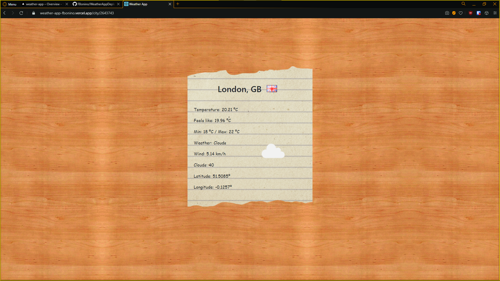
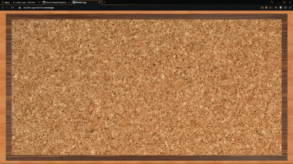
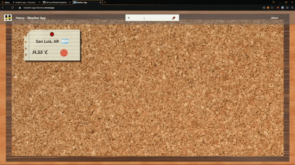

# Weather App

### About

 

App created during Henry's bootcamp to practice __ReactJS__ and __React-Router__ for Frontend Development. Using the [OpenWeather API](http://www.omdbapi.com/) I created a SPA (single page application) that works like a bulletin board and allows a user to:

* Search for a city and it's weather, and pin it's card to the board.
* Add the country to the search query (for example, "London, US") to get the city that is actually being looked for.
* Unpin the city's card from the board.
* See the city's details to get more information about it's weather.

 

### Result

 

The end result is deployed in __Vercel__ and can be accessed through the [Weather App URI](https://weather-app-fbonino.vercel.app).

 

### Preview snapshots

 

<table width = "60%">
	<tr>
		<th> Pin cards </th>
		<th> City details </th>
	</tr>
	<tr>
		<td>  </td>
		<td>  </td>
	</tr>
</table>

### Preview usage

 

<table width = "60%">
	<tr>
		<th> Pin and unpin multiple city cards </th>
		<th> Pin cities with the same name and see detail </th>
	</tr>
	<tr>
		<td>  </td>
		<td>  </td>
	</tr>
</table>